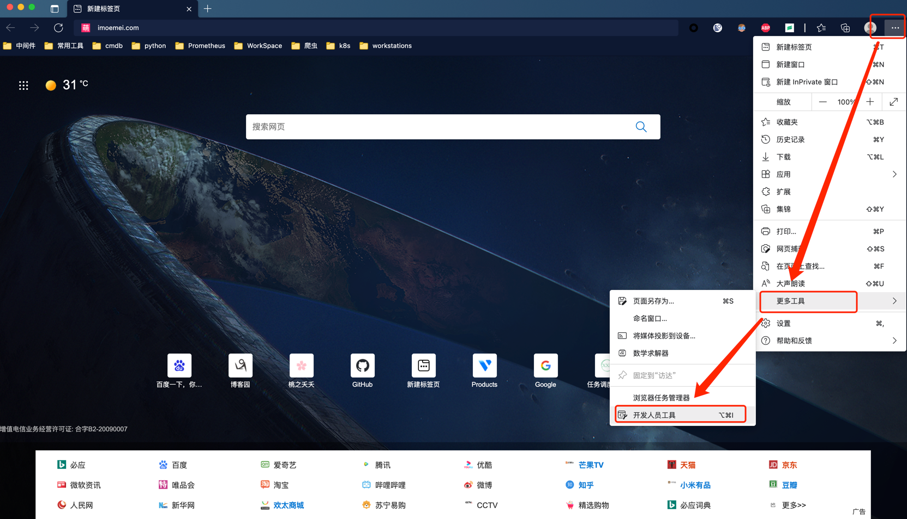
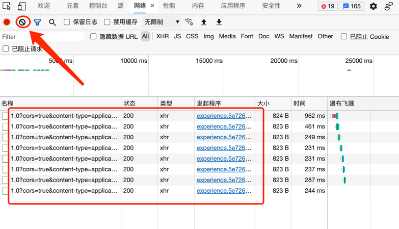
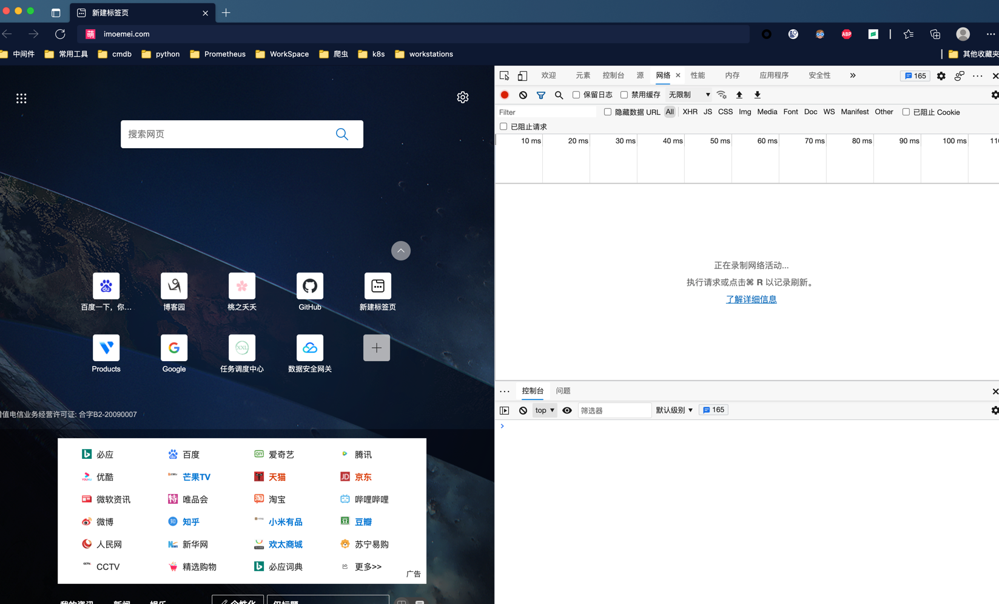
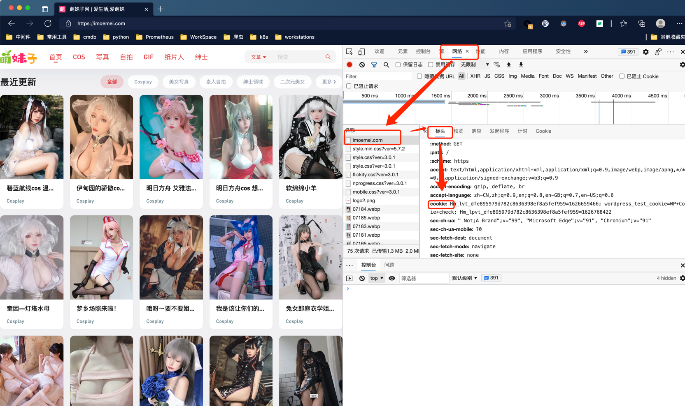

## 绅士便当食用指南

### 声明

本文基于公众号 <印象Python> 中推文《给失恋的室友p爬了2000张Cosplay小姐姐》整理编写，参考了部分代码块。
由于推文中需要关注并私聊作者获取源码，奈何我怕生怕麻烦，所以自己动手补全了代码，加了些自动判断，更适合完全无经验的新手。

### 餐具

Python3.6 + 有关python安装不再教学，windows下注意要勾选自动添加环境变量 其他系统下要注意需要手动写入python环境变量和pip环境变量，或者添加软连接
> 注意：linux和macos下不要直接用python覆盖，应该用python3，或者python3.8这种，否则可能导致
> 原来的包管理工具等服务使用，例如yum，brew 失效。

### 食用步骤

1. 解压本压缩包到任意目录
2. 使用命令行进入到解压后的目录

```bash
# windows下使用win+r快捷键，输入cmd
# 假设目录解压在D:\\lsp便当
# 切换盘符
d: 
# 进入目录
cd lsp便当
# linux or macos
# 安装解压工具，不做详细介绍了，发行版不同，根据子命令安装就可以了,例如centos
yum install unzip
# 解压压缩包
unzip lsp便当
# 进入目录，例如放在/data/lsp便当
cd /data/lsp便当
```

3. 安装第三方依赖库

```bash
# 在目录内执行
pip install -i requirements.txt
# 如果软连接做的是pip3，应当替换为pip3
```

4. 打开浏览器并打开开发人员工具

```bash
# 快捷键
windows:  F12
Macos:  command+option+i
```

如果实在不知道怎么打开，看图，下面是基于chromium内核的edge浏览器，与chrome一样，其他浏览器不会的就自行百度吧


5. 在开发人员工具中的网络TAB将数据清空，防止干扰
   

6. 访问https://imoemei.com
   

7. 在网络——找到imoemei.com——标头——找到cookie，将值全部复制，替换掉代码中的cookie值。
   

8. 运行代码

```shell
python3 lsp.py
```

> linux软连接和环境变量推荐过用python3，而非python，原因不再过度叙述，另外，如果你知道虚拟环境，推荐使用虚拟环境，这样就可以用python，并且不会干扰现有环境。

### 就餐体验


